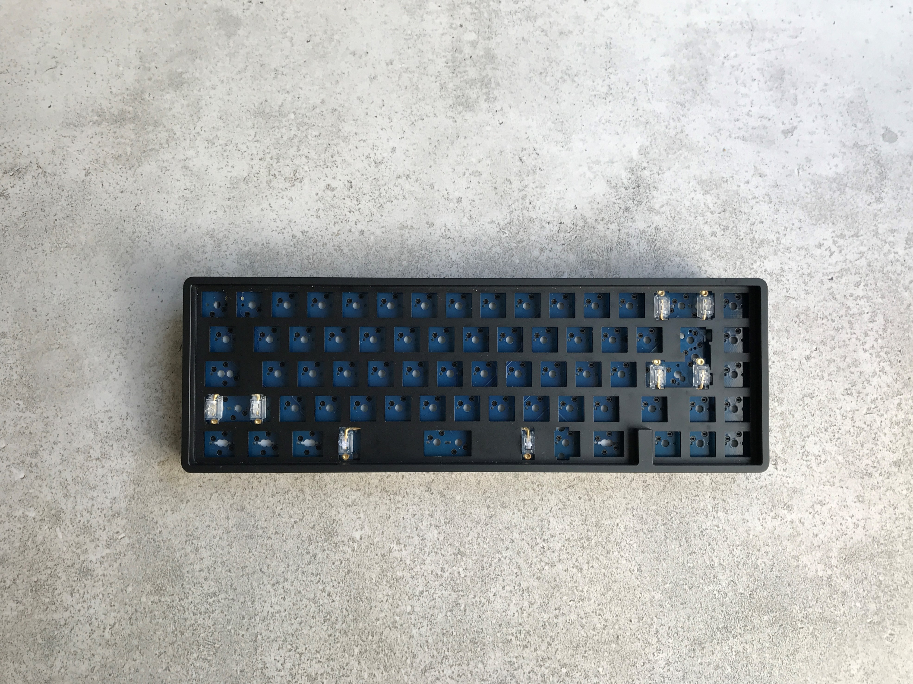
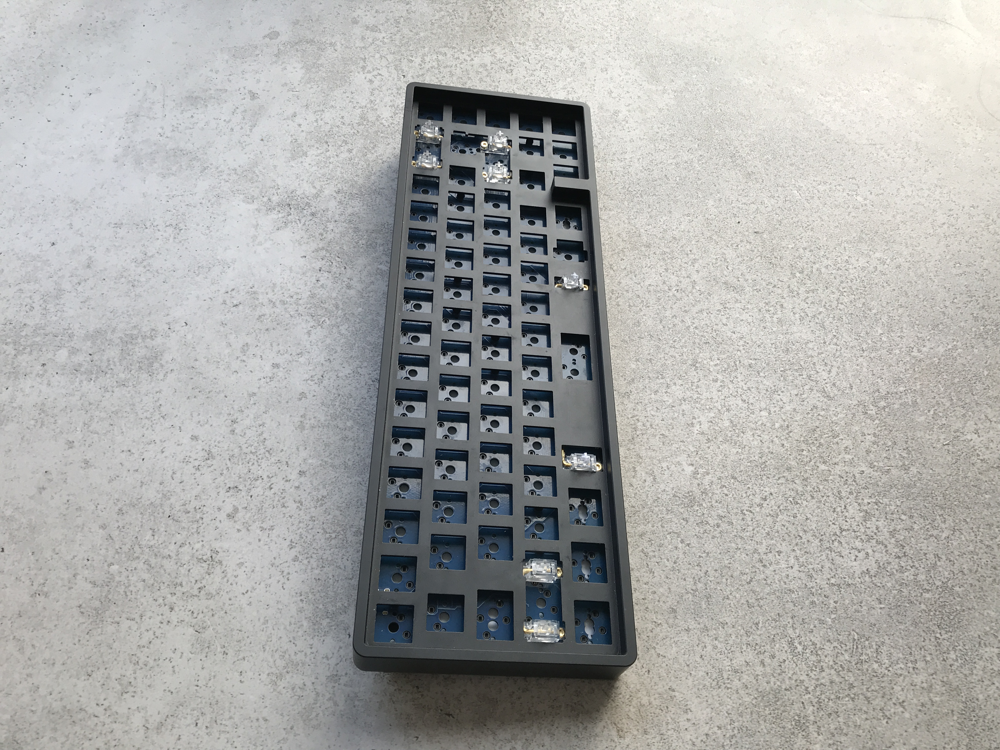
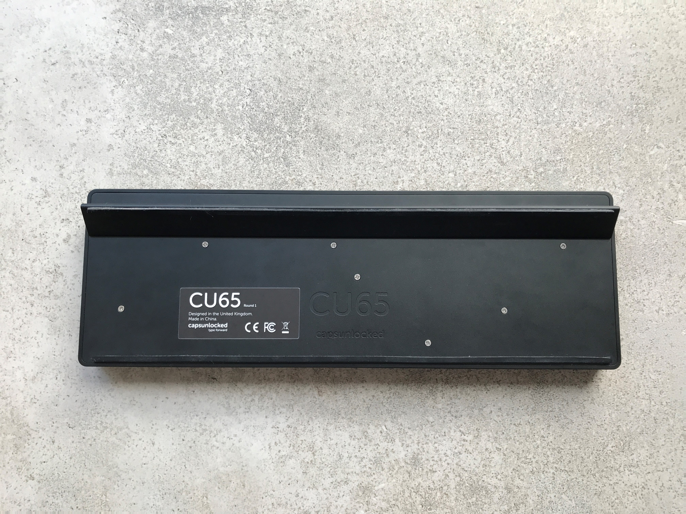

Heya,

Today I will be talking about my first impressions of the CU65 along with my plans for the board in the future. This is not intended to be a full review and I plan to do a more complete review in the near future. The CU65 was a group buy which has ended although they have run 2 more since I got mine so I'd bet on them coming back eventually.

First of all, lets talk about the build quality; the case is made entirely of black anodised aluminium which is very sturdy and high quality. The CU65 is a 65% board which uses an integrated plate design which gives a lot of structural support to the board. Lots of people dislike the ping which is often prevalent in other integrated plate designs although I haven't had a chance to test it out for myself yet. The case has filleted edges and round corners which makes it look very clean and unique. You can use the CU65 at either an 8 degree typing angle with the included aluminium footbar or 0 degrees using the included full-length rubber feet. The CU65 logo is engraved on the back of the board which, in my opinion, looks very nice. Also, they include a sheet of foam to go behind the PCB for a less hollow sound which is nice to see.

The CU65 is quite unique in the fact that the hot-swap PCB supports both ANSI and ISO layouts which makes it a desirable option for ISO users trying to get into the hot-swap scene. The PCB comes with QMK pre-loaded onto them and has support for the popular VIA software for on-the-fly macro setup and layout changing. The board supports both 3 and 5 pin mx style switches and can be used with bot screw-in or standard PCB mount stabilisers. The board has a USB-C port in the top left which is standard for most boards in this price range. When ordering the board, you can choose to add Durock V2 screw in stabilisers in both the clear, and smokey variants. Most of the hot-swap sockets are south-facing although in certain areas they are rotated to allow space for the ISO enter and USB-C socket which is something to keep in mind.

In conclusion, the CU65 is a great option coming in at £119.99 + VAT if you are in the market for an ISO and ANSI hot-swap 65% board. Personally, I'm a fan of the overall design and aesthetics of the board and the fact that it supports both ISO and ANSI layouts was the cherry on top for me. The only minor down-side to the board is the integrated aluminium plate although that is just my personal preference. I'm very excited to build in the CU65 and there will be a full build guide with some Gazzew Boba U4T tactile switches and sound test etc in the coming days, so keep an eye open.