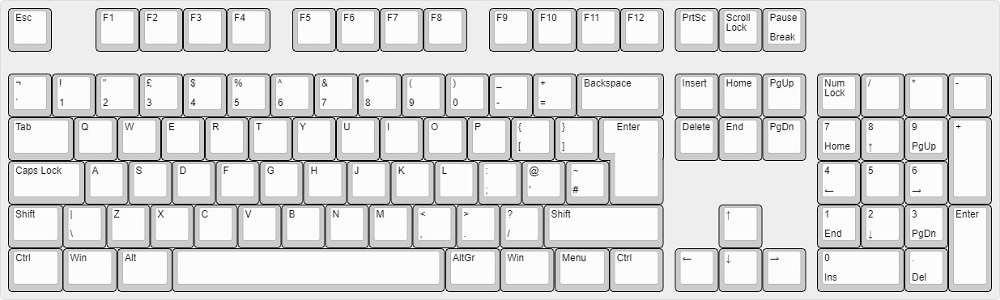
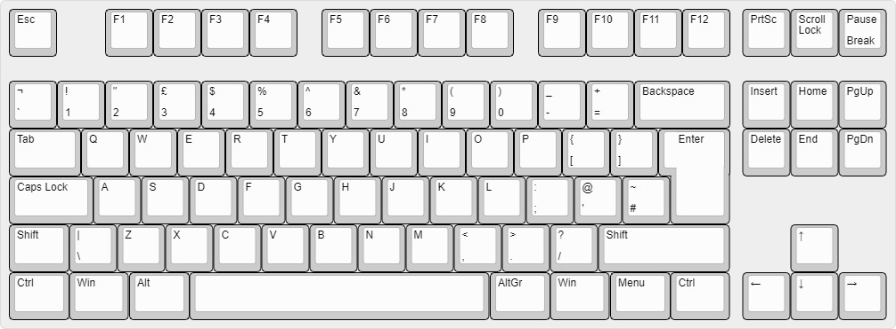
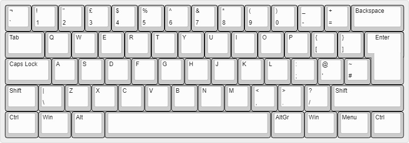
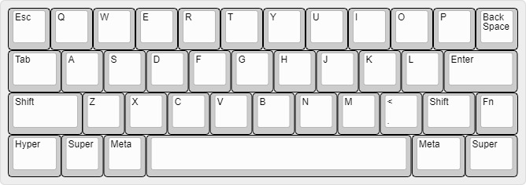
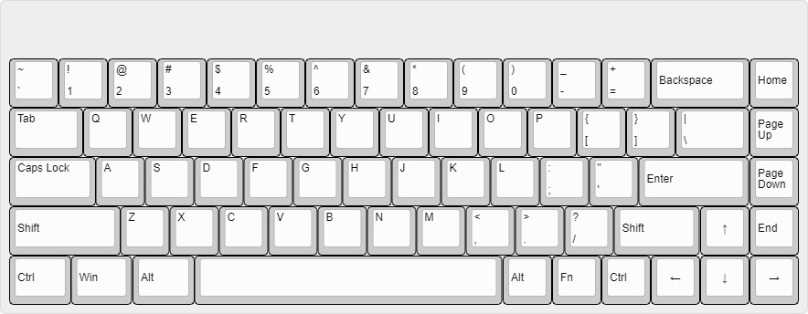
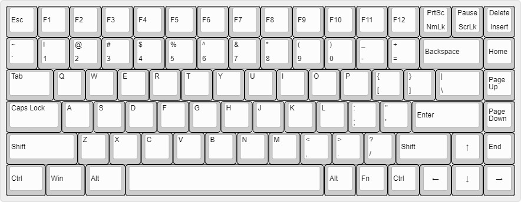

Heya,

When building a mechanical keyboard, it can be overwhelming to see the number of sizes and layouts there are to choose from. This post will explain all of the main sizes and layouts which you may come across when shopping for mechanical keyboards.

# Most Common Keyboard Sizes

### Full-size | 100%

The full-size (100%) keyboard is the most common layout today and most standard, off-the-shelf boards are full size. Full-size keyboards include all of the function keys, arrow keys, numpad and all of the traditional modifiers. Although full-size boards are so common, they are rarely built in the custom mechanical keyboard community as there is a lack of full-size options on the market today.

### Tenkeyless | TKL

The Tenkeyless (TKL) board is similar to the full-size layout although, it doesn't include the numpad. Tenkeyless boards have become much more popular in recent years as there are lots more options on the market. Compact boards often rely on function layers to get full functionality of the board.

### Compact | 60%

The compact (60%) layout doesn't include the numpad, arrow keys or the function row. This is the most common layout in the custom keyboard community at the moment as there are so many options on the market. 

# Less Common Keyboard Sizes

### 40%

40% keyboards only include the alpha keys with no number row and very few modifier keys. Similarly to the compact boards, 40% keyboards rely on function layers to get the full functionality.

### 65%

The 65% is very similar to the compact layout although, it has arrow keys and a few extra modifiers on the far right.

### 75%

The 75% is very similar to the tenkeyless, but it's slitghtly more compact. It's basically a 65% with a function row.

So there you are, the main few keyboard layouts. There are many other layouts which we didn't mention but if we talked about all of the layouts, we would be here all day. If you are interested in any more obscure layouts and sizes then we might make another blog post about some more in the future.